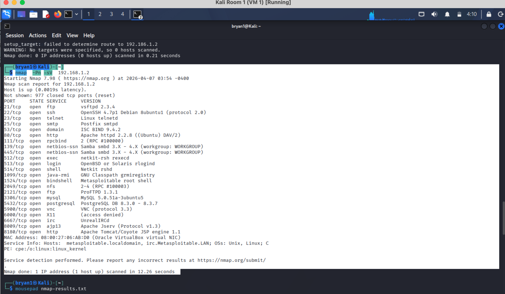

# Lab: Network Enumeration & Service Discovery

### **1. Objective**
The goal of this lab was to perform an active scan of the target network to identify live hosts, open ports, and the specific versions of services running to map the attack surface.

### **2. Execution**
* **Tool:** Nmap
* **Command:** `nmap -sV -O 192.168.1.2`
* **Steps:** 1. Performed service version detection (`-sV`) to identify outdated software.
  2. Used OS Fingerprinting (`-O`) to determine the target operating system (Linux/Ubuntu).

### **3. Proof of Concept**
* **Log:** `nmap-results.txt`
* **Screenshot:** 

### **4. Mitigation**
* **Service Hardening:** Disable unnecessary services and ports (e.g., if MySQL isn't needed externally, block port 3306).
* **Firewalling:** Implement a "Default Deny" policy.
* **Banner Grabbing Defense:** Configure the web server to suppress version numbers in HTTP headers.
