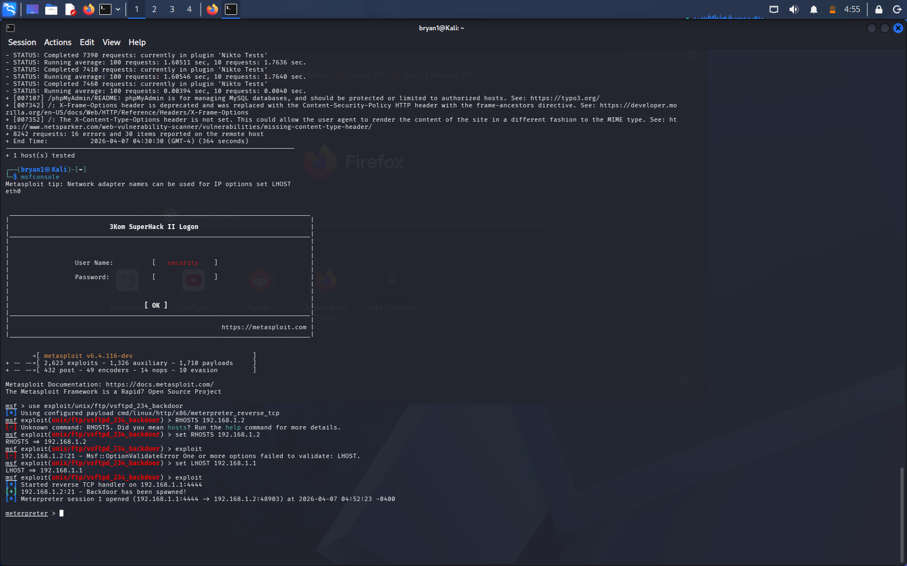

# Lab: Remote Code Execution (RCE) via Samba

### **1. Objective**
Successfully exploit a known vulnerability in the Samba service (UserMapScript) to gain unauthorized root-level access to the target system.

### **2. Execution**
* **Tool:** Metasploit Framework (MSF)
* **Exploit Module:** `exploit/multi/samba/usermap_script`
* **Payload:** `cmd/unix/reverse_netcat`
* **Steps:** Set the `RHOSTS` to the target IP and executed the exploit to establish a reverse shell connection.

### **3. Proof of Concept**
* **Log:** `Metasploit_backdoor_exploit.txt`
* **Screenshot:** 

### **4. Mitigation**
* **Patching:** Update Samba to a secure version (higher than 3.0.25) to remediate CVE-2007-2447.
* **Network Segmentation:** Place sensitive services behind a VPN or internal network only.
