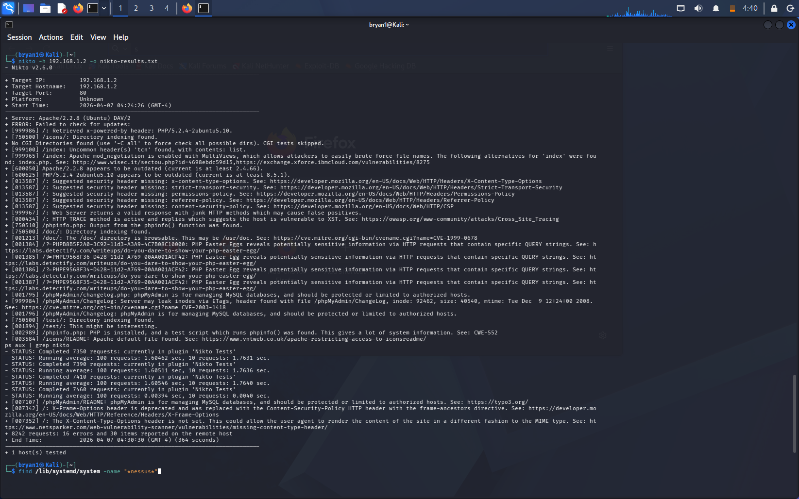

# Lab: Automated Web Application Assessment

### **1. Objective**
Identify common web server misconfigurations and outdated components using automated scanning.

### **2. Execution**
* **Tool:** Nikto
* **Target:** http://192.168.1.2/mutillidae/
* **Findings:** Detected accessible `/config/` directories and missing security headers.

### **3. Proof of Concept**
* **Output:** `nikto-results.txt`
* **Screenshot:** 

### **4. Mitigation Strategy**
* **Directory Security:** Disable directory indexing (Options -Indexes) to prevent attackers from browsing sensitive folders.
* **Security Headers:** Implement `X-Frame-Options: DENY` to prevent clickjacking and `Content-Security-Policy` to mitigate injection attacks.
* **Lifecycle Management:** Decommission the End-of-Life (EOL) Apache 2.2.8 and PHP 5.2.4 instances.
