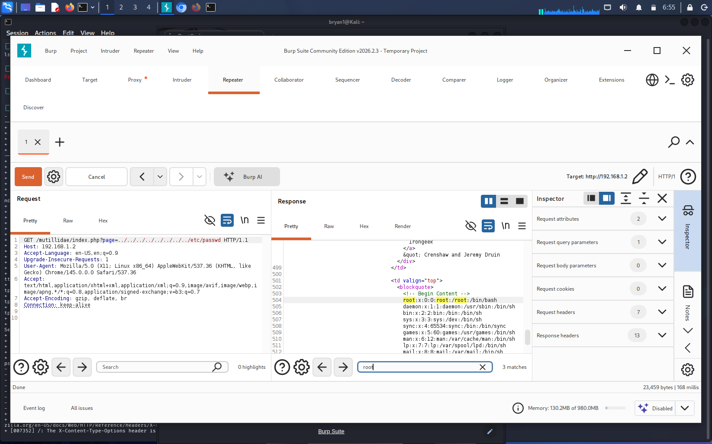

# Lab: Local File Inclusion (LFI) via Path Traversal

### **1. Objective**
Demonstrate how insufficient input validation allows an attacker to navigate the server's filesystem and read sensitive files like `/etc/passwd`.

### **2. Execution**
* **Payload:** `../../../../../../etc/passwd`
* **Steps:** Manually manipulated the `page` parameter in the URL to "break out" of the web directory and access system files.

### **3. Proof of Concept**
* **Code:** `Path_traversal_input.txt`
* **Screenshot:** 

### **4. Mitigation**
* **Input Validation:** Use a whitelist of allowed filenames only.
* **Filesystem Permissions:** Run the web server user with the lowest possible privileges (Chroot jail).
