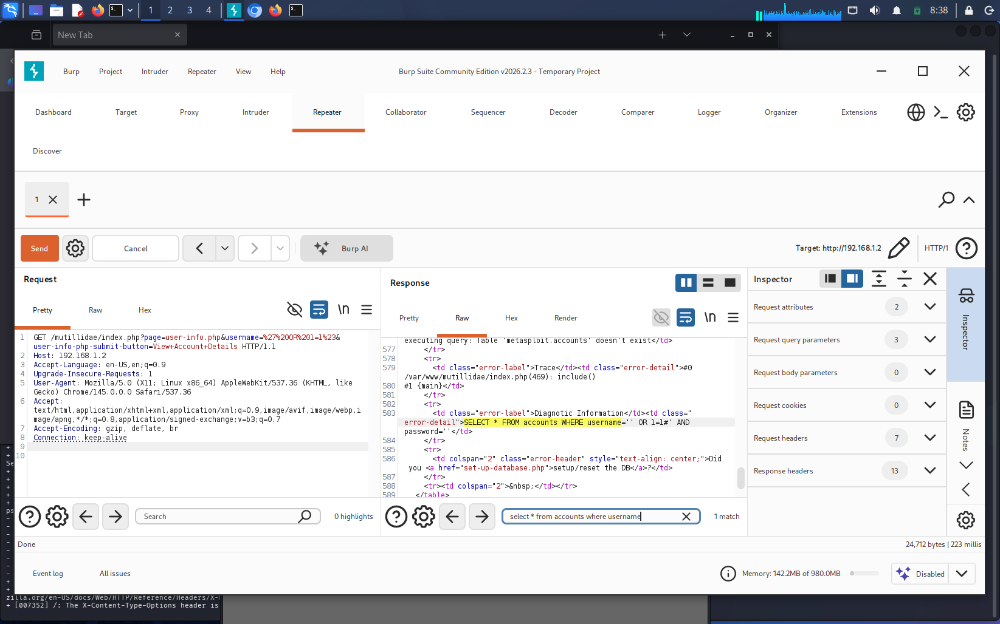

# Lab: Error-Based SQL Injection Discovery

### **1. Objective**
Identify a SQL injection vulnerability by injecting syntax characters that force the backend database to leak information through error messages.

### **2. Execution**
* **Payload:** `' OR 1=1 --`
* **Steps:** Injected a single quote to break the SQL query and used a tautology (`1=1`) to bypass authentication or trigger database errors.

### **3. Proof of Concept**
* **Code:** `SQLi_input.txt`
* **Screenshot:** 

### **4. Mitigation**
* **Prepared Statements:** Use parameterized queries so that user input is never treated as executable code.
* **Generic Error Messages:** Configure the application to show non-descriptive error messages to the user.
